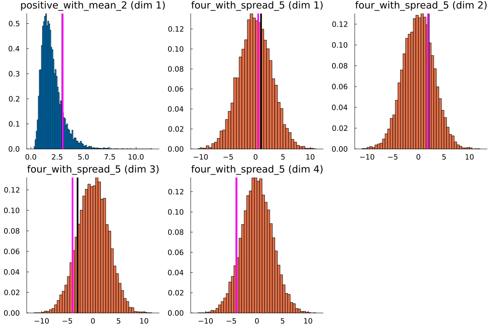
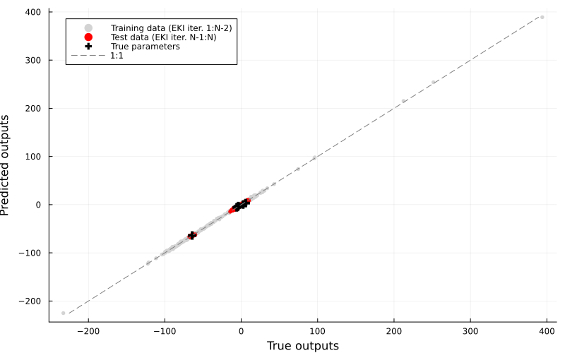
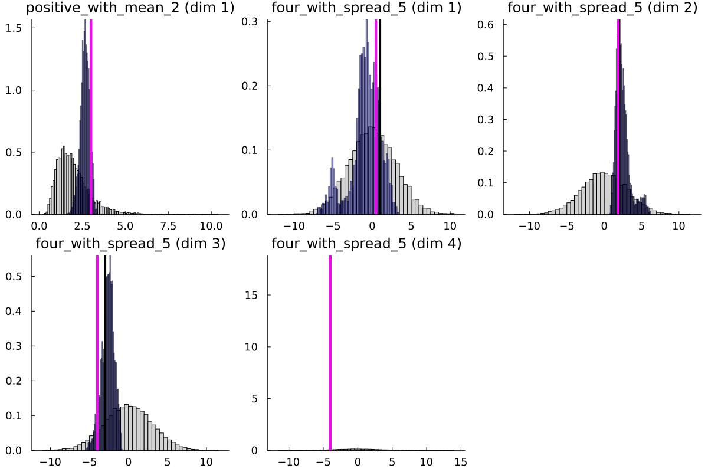

# CalibrateEmulateSample.jl
Implements a derivative-free machine-learning-accelerated pipeline for uncertainty quantification.


| **Documentation**    | [![dev][docs-dev-img]][docs-dev-url]             |
|---------------------:|:-------------------------------------------------|
| **JOSS**             | [![DOI][joss-img]][joss-url]                     |
| **DOI**              | [![DOI][zenodo-img]][zenodo-latest-url]          |
| **Docs Build**       | [![docs build][docs-bld-img]][docs-bld-url]      |
| **Unit tests**       | [![unit tests][unit-tests-img]][unit-tests-url]  |
| **Code Coverage**    | [![codecov][codecov-img]][codecov-url]           |
| **Downloads**        | [![Downloads][dlt-img]][dlt-url]                 |

[joss-img]: https://joss.theoj.org/papers/10.21105/joss.06372/status.svg
[joss-url]: https://doi.org/10.21105/joss.06372

[zenodo-img]: https://zenodo.org/badge/179573047.svg
[zenodo-latest-url]: https://zenodo.org/badge/latestdoi/179573047

[docs-dev-img]: https://img.shields.io/badge/docs-dev-blue.svg
[docs-dev-url]: https://CliMA.github.io/CalibrateEmulateSample.jl/dev/

[docs-bld-img]: https://github.com/CliMA/CalibrateEmulateSample.jl/actions/workflows/Docs.yml/badge.svg
[docs-bld-url]: https://github.com/CliMA/CalibrateEmulateSample.jl/actions/workflows/Docs.yml

[unit-tests-img]: https://github.com/CliMA/CalibrateEmulateSample.jl/actions/workflows/Tests.yml/badge.svg
[unit-tests-url]: https://github.com/CliMA/CalibrateEmulateSample.jl/actions/workflows/Tests.yml

[codecov-img]: https://codecov.io/gh/CliMA/CalibrateEmulateSample.jl/branch/master/graph/badge.svg
[codecov-url]: https://codecov.io/gh/CliMA/CalibrateEmulateSample.jl

[dlm-img]: https://img.shields.io/badge/dynamic/json?url=http%3A%2F%2Fjuliapkgstats.com%2Fapi%2Fv1%2Fmonthly_downloads%2FCalibrateEmulateSample&query=total_requests&suffix=%2Fmonth&label=Downloads
[dlm-url]: https://juliapkgstats.com/pkg/CalibrateEmulateSample.c

[dlt-img]: https://img.shields.io/badge/dynamic/json?url=http%3A%2F%2Fjuliapkgstats.com%2Fapi%2Fv1%2Ftotal_downloads%2FCalibrateEmulateSample&query=total_requests&label=Downloads
[dlt-url]: https://juliapkgstats.com/pkg/CalibrateEmulateSample.c


# Quick links

- [I'm getting errors about the python dependency](https://clima.github.io/CalibrateEmulateSample.jl/dev/installation_instructions/)
- [How do I build prior distributions?](https://clima.github.io/EnsembleKalmanProcesses.jl/dev/parameter_distributions/)
- [How do I build good observational noise covariances](https://clima.github.io/EnsembleKalmanProcesses.jl/dev/observations/)
- [What ensemble size should I take? Which process should I use? What is the recommended configuration?](https://clima.github.io/EnsembleKalmanProcesses.jl/dev/defaults/)
- [Where can I walk through the simple example?](https://clima.github.io/CalibrateEmulateSample.jl/dev/examples/sinusoid_example/)
- [What is the `EnsembleKalmanProcesses.jl` package?](https://clima.github.io/CalibrateEmulateSample.jl/dev/calibrate/)
- [What are the recommendations/defaults for dimension reduction or data processing?](https://clima.github.io/CalibrateEmulateSample.jl/dev/data_processing/)
- [How to I plot or interpret the posterior distribution?](https://clima.github.io/CalibrateEmulateSample.jl/dev/sample/)


# What does it look like to use?
Having installed CES and Plots, you can copy-paste the snippets below to recreate this random experiment (up to random number generation). 

### Calibrate
Below we will outline the current user experience for using `EnsembleKalmanProcesses.jl`.
We solve the classic inverse problem where we learn `y = G(u)`, noisy forward map `G` distributed as `N(0,Γ)`. For example, 
```julia

using LinearAlgebra
sdd=1.0
Γ = (sdd)^2*I
G(u) = [
    1/abs(u[1]),
    sum(u[2:5]),
    prod(u[3:4]),
    u[1]^2-u[2]-u[3],
    u[4],
    u[5]^3,
    ] .+ sdd*randn(6)
true_u = [3, 1, 2,-3,-4]
y = G(true_u)
```
We assume some prior knowledge of the parameters `u` in the problem (such as approximate scales, and the first parameter being positive), then we learn which parameters best fit the data with EKP.

```julia

using CalibrateEmulateSample.EnsembleKalmanProcesses
using CalibrateEmulateSample.EnsembleKalmanProcesses.ParameterDistributions

prior_u1 = constrained_gaussian("positive_with_mean_2", 2, 1, 0, Inf)
prior_u2 = constrained_gaussian("four_with_spread_5", 0, 3, -Inf, Inf, repeats=4)
prior = combine_distributions([prior_u1, prior_u2]) 

N_ensemble = 50
initial_ensemble = construct_initial_ensemble(prior, N_ensemble)
ensemble_kalman_process = EnsembleKalmanProcess(
    initial_ensemble, y, Γ, Inversion(), verbose=true)

N_iterations = 10
for i in 1:N_iterations
    params_i = get_ϕ_final(prior, ensemble_kalman_process)

    G_matrix = hcat(
        [G(params_i[:, i]) for i in 1:N_ensemble]... # Parallelize here!
    )

    update_ensemble!(ensemble_kalman_process, G_matrix)
end

final_solution = get_ϕ_mean_final(prior, ensemble_kalman_process)

# Let's see what's going on!
using Plots
p = plot(prior)
for (i,sp) in enumerate(p.subplots)
    vline!(sp, [true_u[i]], lc="black", lw=4)
    vline!(sp, [final_solution[i]], lc="magenta", lw=4)
end
display(p)

```
We now hvae a quick and cheap estimate of the mode of the distribution here, but no quantified uncertainty. To postprocess in a way that gives us back uncertainty, we will emulate `G` using our current EKP evaluations, and apply a proper sampling algorithm to the emulator. No more evaluations of `G` are required!



# Emulate

We then set up the emulation framework, by getting input-output pairs from the EKP, defining which emulator to use, and defining what space we will train our emulator in. Here, we take a Random Feature emulator, and we decorrelate the training space, using prior (input) and noise (output) covariances. *This stage can take several minutes.*
```julia
using CalibrateEmulateSample
using CalibrateEmulateSample.Emulators
using CalibrateEmulateSample.Utilities
using CalibrateEmulateSample.DataContainers
using Statistics

# get training and test data from EKI iterations
input_output_pairs = get_training_points(ensemble_kalman_process, collect(1:N_iterations-2))
input_output_test = get_training_points(ensemble_kalman_process, collect(N_iterations-1:N_iterations))

#choose an ML tool
input_dim = ndims(prior)
n_features = 200
kernel_structure=SeparableKernel(DiagonalFactor(1e-10),OneDimFactor())

mlt = ScalarRandomFeatureInterface(
    n_features,
    input_dim,
    kernel_structure=kernel_structure,
)


# Define a data encoding recipe for the input-output data
encoder_schedule = [(decorrelate_structure_mat(), "in_and_out")]
encoder_kwargs = (; prior_cov = cov(prior), obs_noise_cov = Γ)

# create emulator and train
emulator = Emulator(
    mlt,
    input_output_pairs;
    encoder_schedule = deepcopy(encoder_schedule),
    encoder_kwargs = deepcopy(encoder_kwargs),
)

optimize_hyperparameters!(emulator)
```

It is essential to validate the emulator. Here we just predict on train, test and the true parameters to validate the mean prediction lies near 1:1. We recommend you do much more than just this to check your emulator is working as expected!
```julia
# make some predictions, and plot
pred_true_mean, pred_true_cov = predict(emulator, reshape(true_u,:,1))
pred_train_mean, pred_train_cov = predict(emulator, get_inputs(input_output_pairs))
pred_test_mean, pred_test_cov = predict(emulator, get_inputs(input_output_test))

pp = scatter(
    vec(get_outputs(input_output_pairs)),
    vec(pred_train_mean),
    xlabel="True outputs",
    ylabel="Predicted outputs",
    label="Training data (EKI iter. 1:N-2)",
    color=:lightgrey,
    markersize=3,
    markerstrokewidth = 0,
    size=(1.6*500,500),
)
scatter!(
    pp,
    vec(get_outputs(input_output_test)),
    vec(pred_test_mean),
    label="Test data (EKI iter. N-1:N)",
    color=:red,
    markersize=3,
    markerstrokewidth = 0,
)
scatter!(
    pp,
    vec(y),
    vec(pred_true_mean),
    color=:black,
    label="True parameters",
    markersize=6,
    markerstrokewidth = 4,
    marker=:+,
)

lo = minimum([minimum(pred_train_mean), minimum(pred_test_mean), minimum(y)])
hi = maximum([maximum(pred_train_mean), maximum(pred_test_mean), minimum(y)])
plot!(pp, [lo, hi], [lo, hi]; lc = :grey, ls = :dash, label = "1:1")
display(pp)

```



# Sample

Having created a suitable emulator, we can pass everything into the sampler, here a random walk metropolis algorithm (MCMC). We find a suitable step size and then draw 100,000 samples from the emulator-based posterior.
```julia
using CalibrateEmulateSample.MarkovChainMonteCarlo
mcmc = MCMCWrapper(RWMHSampling(), y, prior, emulator; init_params = get_u_mean_final(ensemble_kalman_process))

new_step = optimize_stepsize(mcmc; init_stepsize = 1.0, N = 2000, discard_initial = 0) # find stepsize

chain = MarkovChainMonteCarlo.sample(mcmc, 100_000; stepsize = new_step, discard_initial = 2_000) # sample

posterior = MarkovChainMonteCarlo.get_posterior(mcmc, chain)
```

We can plot the prior-posterior, and observe (at least) how the marginals capture the EKI optimum and the true parameter values.
```julia
# plot marginals
ppp = plot(prior, fill = :lightgray)
plot!(ppp, posterior, fill = :darkblue, alpha = 0.5)
for (i,sp) in enumerate(ppp.subplots)
    vline!(sp, [true_u[i]], lc="black", lw=4)
    vline!(sp, [final_solution[i]], lc="magenta", lw=4)
end
display(ppp)
```

We see that the approximate posterior contains both EKI and the true parameter, and that the the parameter `four_with_spread_5(dim 4)` is highly constrained, while `four_with_spread_5(dims 1)` and `(dim 4)` are least constrained by the observations, coinciding with the EKI performance. More detail on correlation structure can be extracted by pair-plotting, and posterior analysis.




