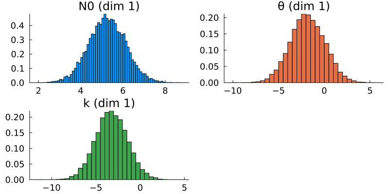
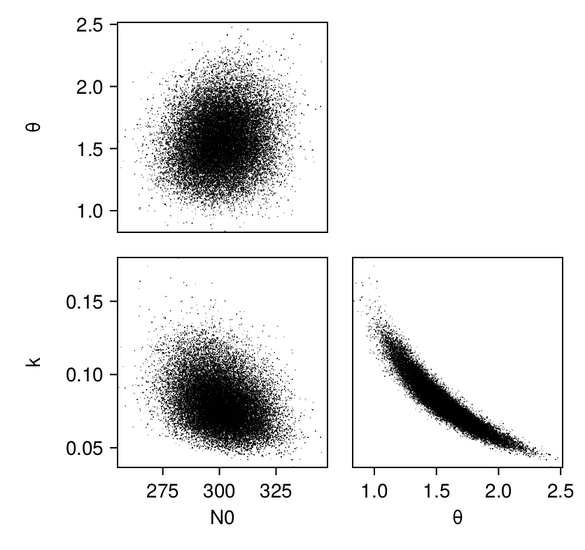

# [Learning the initial parameters of a droplet mass distribution in Cloudy](@id Cloudy-example)


This example is based on [Cloudy](https://github.com/CliMA/Cloudy.jl.git), a
microphysics model that simulates how cloud droplets collide and coalesce into
larger drops. Collision-coalescence is a crucial process for the formation of
rain. 

Cloudy is initialized with a mass distribution of the cloud droplets; this
distribution is then stepped forward in time, with more and more droplets
colliding and combining into bigger drops according to the droplet-droplet
interactions specified by a collision-coalescence kernel. The evolution of the
droplet distribution is completely determined by the shape of the initial distribution and the form of the kernel.

We will show how Calibrate-Emulate-Sample (CES) can be used to learn the parameters of the initial cloud droplet mass distribution from observations of the moments of that mass distribution at a later time. 

Cloudy is used here in a "perfect model" (aka "known truth") setting, which
means that the "observations" are generated by Cloudy itself, by running it with
the true parameter values---in more realistic applications, one would use actual
measurements of cloud properties.

The following schematic gives an overview of the example:


The input to the CES algorithm consists of data ``y``, the observational covariance ``Γ``, and prior parameter distributions. The data, a vector of moments of the droplet mass distribution, are obtained by running Cloudy with the parameters set to their true values. The covariance is obtained from model output. The calibration stage is performed by an ensemble Kalman inversion (EKI), in which Cloudy has to be run once per iteration and for each ensemble member. The resulting input-output pairs ``\{\theta_i, \mathcal{G}(\theta_i)\}_i`` are used to train an emulator model. This emulator ``\widetilde{\mathcal{G}}(\theta)`` is cheap to evaluate; it replaces the original parameter-to-data map in the Markov chain Monte Carlo (MCMC) sampling, which produces (approximate) samples of the posterior parameter distribution. These samples are the final output of the CES algorithm. 

[This paper](https://agupubs.onlinelibrary.wiley.com/doi/full/10.1029/2022MS002994) describes Cloudy in much more detail and shows results of experiments using
CES to learn model parameters.


### Prerequisites

In order to run this example, you need to install `Cloudy.jl`. The example was
written using Cloudy v0.3.0, which you can install as follows:
```julia
pkg > add https://github.com/CliMA/Cloudy.jl.git#v0.3.0
```

### Running the example

`Cloudy_calibrate.jl` performs the calibration using ensemble Kalman
inversion; `Cloudy_emulate_sample.jl` fits an emulator and uses it to sample the
posterior distributions of the parameters.
Once Cloudy is installed, the example can be run from the julia REPL:
```julia
include("Cloudy_calibrate.jl")
include("Cloudy_emulate_sample.jl")
```

### Walkthrough of the code: `Cloudy_calibrate.jl`

This file performs the calibration stage of CES.

#### Import packagages and modules

First we load standard packages,

```julia
using Distributions
using StatsBase
using LinearAlgebra
using StatsPlots
using Plots
using Plots.PlotMeasures
using Random
using JLD2
```

the Cloudy modules,

```julia
using Cloudy
using Cloudy.ParticleDistributions
using Cloudy.KernelTensors

# Import the module that runs Cloudy
include(joinpath(@__DIR__, "DynamicalModel.jl"))
```

and finally the EKP packages.

```julia
using EnsembleKalmanProcesses
using EnsembleKalmanProcesses.Observations
using EnsembleKalmanProcesses.ParameterDistributions
using EnsembleKalmanProcesses.DataContainers
using EnsembleKalmanProcesses.PlotRecipes
```

The module `DynamicalModel.jl` is the forward solver; it provides a function
that runs Cloudy with a given instance of the parameter vector we want to learn.

```julia
include("DynamicalModel.jl")
```

#### Define the true parameters

We define the true parameters---they are known here because this is a known
truth example. Knowing the true parameters will allow us to assess how well
Calibrate-Emulate-Sample has managed to solve the inverse problem.

We will assume that the true particle mass distribution is a Gamma distribution,
which at time ``t = 0`` has parameters ``\phi_0 = [N_{0, 0}, k_0, \theta_0]``. We will then try to learn these parameters from observations ``y = [M_0(t_{end}), M_1(t_{end}), M_2(t_{end})]`` of the zeroth-, first-, and second-order moments
of the distribution at time ``t_{end} > 0`` (where `t_end = 1.0` in this
example). The true parameters ``\phi_{0, \text{true}}`` are defined as follows:

```julia
param_names = ["N0", "θ", "k"]
n_params = length(param_names)
N0_true = 300.0  # number of particles (scaling factor for Gamma distribution)
θ_true = 1.5597  # scale parameter of Gamma distribution
k_true = 0.0817  # shape parameter of Gamma distribution
ϕ_true = [N0_true, θ_true, k_true] # true parameters in constrained space
dist_true = ParticleDistributions.GammaPrimitiveParticleDistribution(ϕ_true...)
```

#### Define priors for the parameters

As we are working with Bayesian methods, we treat the parameters we want to
learn as random variables whose prior distributions we specify here. The prior
distributions will behave like an "initial guess" for the likely region of
parameter space where we expect the solution to be located.
We use `constrained_gaussian` to add the desired scale and bounds to the prior
distribution, in particular we place lower bounds to preserve positivity (and
numerical stability). 

```julia
# We choose to use normal distributions to represent the prior distributions of
# the parameters in the transformed (unconstrained) space.
prior_N0 = constrained_gaussian(param_names[1], 400, 300, 0.4 * N0_true, Inf)
prior_θ = constrained_gaussian(param_names[2], 1.0, 5.0, 1e-1, Inf)
prior_k = constrained_gaussian(param_names[3], 0.2, 1.0, 1e-4, Inf)
priors = combine_distributions([prior_N0, prior_θ, prior_k])
```

The plot recipe for `ParameterDistribution` types allows for quick visualization of the priors:

```julia
# Plot the priors
p = plot(priors, constrained=false)
savefig(p, output_directory * "cloudy_priors.png")
```



#### Generate (synthetic) observations
We generate synthetic observations by running Cloudy 100 times with the true
parameters (i.e., with the true initial Gamma distribution of droplet masses) and then adding noise to simulate measurement error.

```julia
dyn_model_settings_true = DynamicalModel.ModelSettings(
    kernel, dist_true, moments, tspan)

G_t = DynamicalModel.run_dyn_model(ϕ_true, dyn_model_settings_true)
n_samples = 100
y_t = zeros(length(G_t), n_samples)
# In a perfect model setting, the "observational noise" represents the 
# internal model variability. Since Cloudy is a purely deterministic model, 
# there is no straightforward way of coming up with a covariance structure 
# for this internal model variability. We decide to use a diagonal 
# covariance, with entries (variances) largely proportional to their 
# corresponding data values, G_t
Γy = convert(Array, Diagonal([100.0, 5.0, 30.0]))
μ = zeros(length(G_t))

# Add noise
for i in 1:n_samples
    y_t[:, i] = G_t .+ rand(MvNormal(μ, Γy))
end

truth = Observations.Observation(y_t, Γy, data_names)
truth_sample = truth.mean 
```

#### Perform ensemble Kalman inversion

We sample the initial ensemble from the prior and create the
`EnsembleKalmanProcess` object as an ensemble Kalman inversion (EKI) algorithm
using the `Inversion()` keyword. We also use the `DataMisfitController()`
learning rate scheduler. The number of ensemble members must be larger than the dimension of the parameter space to ensure a full rank ensemble covariance.

```julia
N_ens = 50 # number of ensemble members
N_iter = 8 # number of EKI iterations
# initial parameters: n_params x N_ens
initial_params = construct_initial_ensemble(rng, priors, N_ens)
ekiobj = EnsembleKalmanProcess(
    initial_params,
    truth_sample,
    truth.obs_noise_cov,
    Inversion(),
    scheduler=DataMisfitController()
)
```

We perform the inversion loop. Remember that within calls to `get_ϕ_final` the
EKP transformations are applied, thus the ensemble that is returned will be the
gamma distribution parameters that can be used to run the forward model, rather
than their corresponding values in the unconstrained space where the EKI takes
place. Each ensemble member is stored as a column and therefore for uses such as plotting one needs to reshape to the desired dimension.

```julia
# Initialize a ParticleDistribution with dummy parameters. The parameters 
# will then be set within `run_dyn_model`
dummy = ones(n_params)
dist_type = ParticleDistributions.GammaPrimitiveParticleDistribution(dummy...)
model_settings = DynamicalModel.ModelSettings(kernel, dist_type, moments, tspan)
# EKI iterations
for n in 1:N_iter
    # Return transformed parameters in physical/constrained space
    ϕ_n = get_ϕ_final(priors, ekiobj)
    # Evaluate forward map
    G_n = [DynamicalModel.run_dyn_model(ϕ_n[:, i], model_settings) for i in 1:N_ens]
    G_ens = hcat(G_n...)  # reformat
    EnsembleKalmanProcesses.update_ensemble!(ekiobj, G_ens)
end
```

#### Visualize and store the results of the calibration

The optimal parameter vector determined by the ensemble Kalman inversion is the
ensemble mean of the particles after the last iteration, which is printed to
standard output. An output directory is created, where a file
`cloudy_calibrate_results.jld2` is stored, which contains all parameters and
model output from the ensemble Kalman iterations (both as
`DataContainers.DataContainer` objects), the mean and one sample of the
synthetic observations, as well as the true prameters and their priors. In
addition, an animation is produced that shows the evolution of the ensemble of
particles over subsequent iterations of the optimization, both in the
computational (unconstrained) and physical (constrained) spaces.


### Walkthrough of the code: `Cloudy_emulate_sample.jl`

This file performs the emulation and sampling stages of the CES algorithm.


#### Import packages and modules

First, we import some standard packages
```julia
using Distributions
using StatsBase
using GaussianProcesses
using LinearAlgebra
using Random
using JLD2
ENV["GKSwstype"] = "100"
using CairoMakie, PairPlots
```

as well as the relevant CES packages needed to construct the emulators and
perform the Markov chain Monte Carlo (MCMC) sampling. We also need some functionality of `EnsembleKalmanProcesses.jl`.

```julia
using CalibrateEmulateSample.Emulators
using CalibrateEmulateSample.MarkovChainMonteCarlo
using CalibrateEmulateSample.Utilities
using EnsembleKalmanProcesses
using EnsembleKalmanProcesses.ParameterDistributions
using EnsembleKalmanProcesses.DataContainers
```

#### Load the calibration results

We will train the emulator on the input-output pairs we obtained during the
calibration. They are stored within the `EnsembleKalmanProcess` object
(`ekiobj`), which is loaded here together with the other information that was
saved in the calibration step.

```julia
ekiobj = load(data_save_file)["eki"]
priors = load(data_save_file)["priors"]
truth_sample_mean = load(data_save_file)["truth_sample_mean"]
truth_sample = load(data_save_file)["truth_sample"]
# True parameters:
# - ϕ: in constrained space
# - θ: in unconstrained space
ϕ_true = load(data_save_file)["truth_input_constrained"]
θ_true = transform_constrained_to_unconstrained(priors, ϕ_true)
```

The user can choose one or both of two emulators: a Gaussian Process (GP) emulator with `GaussianProcesses.jl` interface (`gp-gpjl`) and a scalar Random Feature
(RF) interface (`rf-scalar`). See
[here](https://clima.github.io/CalibrateEmulateSample.jl/previews/PR257/examples/emulators/regression_2d_2d)
for a complete overview of the available emulators. 

```julia
cases = [
    "rf-scalar",
    "gp-gpjl"  # Veeeery slow predictions
]
```

We first define some settings for the two emulators, e.g., the prediction type
for the GP emulator, or the number of features and hyperparameter optimizer
options for the RF emulator. The docs for GPs and RFs (TODO: add links!) explain the different options in more detail and provide some useful heuristics for how to customize the settings depending on the problem at hand.

```julia
# These settings are the same for all Gaussian Process cases
pred_type = YType() # we want to predict data

# These settings are the same for all Random Feature cases
n_features = 400 
nugget = 1e-8
optimizer_options = Dict(
    "verbose" => true,
    "scheduler" => DataMisfitController(terminate_at = 100.0),
    "cov_sample_multiplier" => 1.0,
    "n_iteration" => 20,
)
```

Emulation is performed through the construction of an `Emulator` object from the
following components:
* a wrapper for the machine learning tool (`mlt`) to be used as emulator
* the input-output pairs on which the emulator will be trained
* optional arguments specifying data processing and dimensionality reduction
  functionality 

For `gp-gpjl`, this looks as follows:
```julia
gppackage = GPJL()
# Kernel is the sum of a squared exponential (SE), Matérn 5/2, and white noise
gp_kernel = SE(1.0, 1.0) + Mat52Ard(zeros(3), 0.0) + Noise(log(2.0))

# Wrapper for GP
mlt = GaussianProcess(
    gppackage;
    kernel = gp_kernel,
    prediction_type = pred_type,
    noise_learn = false,
)
```

And similarly for `rf-scalar`:

```julia
kernel_structure = SeparableKernel(
    LowRankFactor(n_params, nugget),
    OneDimFactor()
)

mlt = ScalarRandomFeatureInterface(
    n_features,
    n_params,
    kernel_structure = kernel_structure,
    optimizer_options = optimizer_options,
)

```

We construct the emulator using all input-output pairs obtained in the
calibration stage, and we want the output data to be decorrelated with information from Γy:

```
input_output_pairs = get_training_points(ekiobj,
                                          length(get_u(ekiobj))-1)

# Use the medians of the outputs as standardizing factors
norm_factors = get_standardizing_factors(
    get_outputs(input_output_pairs)
)

emulator = Emulator(
    mlt,
    input_output_pairs,
    obs_noise_cov = Γy,
    standardize_outputs = true,
    standardize_outputs_factors = vcat(norm_factors...),
)
```

#### Train the emulator

The emulator is trained when we combine the machine learning tool and the data
into the `Emulator` above. We must also optimize the hyperparameters:

```julia
optimize_hyperparameters!(emulator)
```

To test the predictive skill of the emulator, we can e.g. compare its prediction
on the true parameters to the true data. (One could also hold out a subset of
the input-output pairs from the training and evaluate the emulator's predictions
on them).

```julia
# Check how well the emulator predicts on the true parameters
y_mean, y_var = Emulators.predict(
    emulator,
    reshape(θ_true, :, 1);
    transform_to_real = true
)

println("Emulator ($(case)) prediction on true parameters: ")
println(vec(y_mean))
println("true data: ")
println(truth_sample) # what was used as truth
```

The emulator predicts both a mean value and a covariance.

### Sample the posterior distributions of the parameters

The last step is to plug the emulator into an MCMC algorithm, which is then used to produce samples from the posterior distribution of the parameters. Essentially, the emulator acts as a stand-in for the original forward model (which in most cases of interest is computationally expensive to run) during the MCMC sampling process.

We use the mean across all parameter ensembles from the EKI as the initial
parameters for the MCMC. Before running the actual MCMC chain, we determine a good step size by running chains of length `N = 2000`:

```julia
# initial values
u0 = vec(mean(get_inputs(input_output_pairs), dims = 2))
println("initial parameters: ", u0)

# First let's run a short chain to determine a good step size
yt_sample = truth_sample
mcmc = MCMCWrapper(
    RWMHSampling(),
    truth_sample,
    priors,
    emulator;
    init_params = u0
)

new_step = optimize_stepsize(
    mcmc;
    init_stepsize = 0.1,
    N = 2000,
    discard_initial = 0
)
```

We choose a sample size of 100,000 for the actual MCMC, discarding the first
1,000 samples as burn-in:

```julia
# Now begin the actual MCMC
println("Begin MCMC - with step size ", new_step)
chain = MarkovChainMonteCarlo.sample(
    mcmc,
    100_000;
    stepsize = new_step,
    discard_initial = 1_000
)
```

After running the MCMC, we can extract the posterior samples as follows:

```julia
posterior = MarkovChainMonteCarlo.get_posterior(mcmc, chain)
```

The samples of the posterior distributions represent the ultimate output of the
CES process. By constructing histograms of these samples and comparing them with
the known true parameter values, we can evaluate the results' accuracy. Ideally,
the peak of the posterior distribution should converge near the true values,
indicating a high-quality estimation. Additionally, visualizing the prior
distributions alongside the posteriors shows the distributional change effected by the Bayesian learning process.

### Results

We first produce pair plots (also known as corner plots or scatter plot matrices) to visualize the posterior parameter distributions as a grid of histograms. Recall that the task was to solve the inverse problem of finding the parameters ``N_{0, 0}``, ``k_0``, and ``\theta_0``, which define a gamma distribution of droplet masses in Cloudy at time ``t = 0``.

```julia
# Make pair plots of the posterior distributions in the unconstrained
# and in the constrained space (this uses `PairPlots.jl`)
figpath_unconstr = joinpath(output_directory,
                            "joint_posterior_unconstr.png")
figpath_constr = joinpath(output_directory,
                          "joint_posterior_constr.png")
labels = get_name(posterior)

data_unconstr = (; [(Symbol(labels[i]),
                     posterior_samples_unconstr[i, :]) for i in 1:length(labels)]...)
data_constr = (; [(Symbol(labels[i]),
                   posterior_samples_constr[i, :]) for i in 1:length(labels)]...)

p_unconstr = pairplot(data_unconstr => (PairPlots.Scatter(),))
p_constr = pairplot(data_constr => (PairPlots.Scatter(),))
```

For the scalar RF emulator, the results (shown in the constrained/physical space) look as follows:



In addition, we plot the marginals of the posterior distributions:
```julia
for idx in 1:n_params

    # Find the range of the posterior samples
    xmin = minimum(posterior_samples_constr[idx, :])
    xmax = maximum(posterior_samples_constr[idx, :])

    # Create a figure and axis for plotting
    fig = Figure(; size = (800, 600))
    ax = Axis(fig[1, 1])

    # Histogram for posterior samples
    hist!(ax, posterior_samples_constr[idx, :], bins = 100,
          color = :darkorange, label = "posterior")

    # Plotting the prior distribution
    hist!(ax, prior_samples_constr[idx, :], bins = 10000,
          color = :slategray)

    # Adding a vertical line for the true value
    vlines!(ax, [ϕ_true[idx]], color = :indigo, linewidth = 2.6,
            label = "true " * param_names[idx])

    xlims!(ax, xmin, xmax)
    ylims!(ax, 0, Inf)

    # Setting title and labels
    ax.title = param_names[idx]
    ax.xlabel = "Value"
    ax.ylabel = "Density"
```
This is what the marginal distributions of the three parameters look like, again for the case of scalar RF and plotted in the constrained/physical space:


Here, the posterior distributions are shown as orange histograms, the prior distribution are shown as grey histograms (though with the exception of the parmaeter `k`, they are barely visible), and the true parameter values are marked as vertical purple lines.


### Appendix: What Does Cloudy Do?

For the purpose of Bayesian parameter learning, the forward model can be treated
as a black box that processes input parameters to yield specific outputs.
However, for those who wish to learn more about the inner workings of Cloudy, we refer to [his paper](https://agupubs.onlinelibrary.wiley.com/doi/full/10.1029/2022MS002994) and offer a brief outline below:

The mathematical starting point of [Cloudy](https://github.com/CliMA/Cloudy.jl.git) is the stochastic collection equation (SCE; sometimes also called [Smoluchowski equation](https://en.wikipedia.org/wiki/Smoluchowski_coagulation_equation#:~:text=In%20statistical%20physics%2C%20the%20Smoluchowski,size%20x%20at%20time%20t.) after Marian Smoluchowski), which describes the time rate of change of ``f = f(m, t)``, the mass distribution function of liquid water droplets, due to the process of collision and coalescence. The distribution function ``f`` depends on droplet mass ``m`` and time ``t`` and is defined such that ``f(m) \text{ d}m`` denotes the number of droplets with masses in the interval $[m, m + dm]$ per unit volume. 

The stochastic collection equation is an integro-differential equation that can be written as 

```math
    \frac{\partial f(m, t)}{\partial t} = \frac{1}{2} \int_{m'=0}^{\infty} f(m', t) f(m-m', t)  \mathcal{C}(m', m-m')\text{d}m' - f(m, t) \int_{m'=0}^\infty f(m', t)\mathcal{C}(m, m') \text{d}m', 
```

where ``\mathcal{C}(m', m'')`` is the collision-coalescence kernel, which  encapsulates the physics of droplet-droplet interactions -- it describes the rate at which two drops of masses ``m'`` and ``m''`` come into contact and coalesce into a drop of mass ``m' + m''``. The first term on the right-hand side of the SCE describes the rate of increase of the number of drops having a mass ``m`` due to collision and coalescence of drops of masses ``m'`` and ``m-m'`` (where the factor ``\frac{1}{2} `` avoids double counting), while the second term describes the rate of reduction of drops of mass ``m`` due to collision and coalescence of drops having a mass ``m`` with other drops. 

We can rewrite the SCE in terms of the moments ``M_k`` of ``f``, which are the prognostic variables in Cloudy. They are defined by
```math
    M_k = \int_0^\infty m^k f(m, t) \text{d}m
```

The time rate of change of the k-th moment of ``f`` is obtained by multiplying the SCE by ``m^k`` and integrating over the entire range of droplet masses (from ``m=0`` to ``\infty``), which yields
```math
    \frac{\partial M_k(t)}{\partial t} = \frac{1}{2}\int_0^\infty \left((m+m')^k - m^k - {m'}^k\right) \mathcal{C}(m, m')f(m, t)f(m', t) \, \text{d}m\, \text{d}m' ~~~~~~~~ (1)
``` 

In this example, the kernel is set to be constant -- ``\mathcal{C}(m', m'') = B = \text{const}`` -- and the cloud droplet mass distribution is assumed to be a ``\text{Gamma}(k_t, \theta_t)`` distribution, scaled by a factor ``N_{0,t}`` which denotes the droplet number concentration:
```math
f(m, t) = \frac{N_{0,t}}{\Gamma(k_t)\theta_t^k} m^{k_t-1} \exp{(-m/\theta_t)}
```
The parameter vector ``\phi_t= [N_{0,t}, k_t, \theta_t]`` changes over time (as indicated by the subscript ``t``), as the shape of the distribution evolves. In fact, there is a priori no reason to assume that the distribution would retain its Gamma shape over time, but this is a common assumption that is made in order to solve the closure problem (without this assumption, one would have to keep track of infinitely many moments of the mass distribution in order to uniquely identify the distribution ``f`` at each time step, which is obviously not practicable).

For Gamma mass distribution functions, specifying the first three moments (``M_0``, ``M_1``, and ``M_2``) is sufficient to uniquely determine the parameter vector ``\phi_t``, hence Cloudy solves equation (1) for ``k = 0, 1, 2``. This mapping of the parameters of the initial cloud droplet mass distribution to the (zeroth-, first-, and second-order) moments of the distribution at a specified end time is done by `DynamicalModel.jl`.


