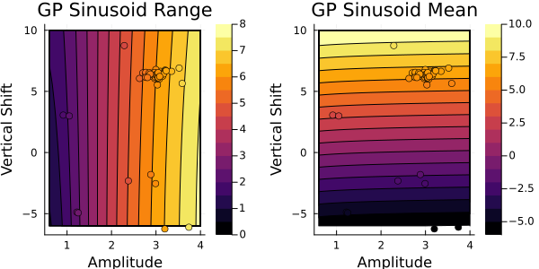
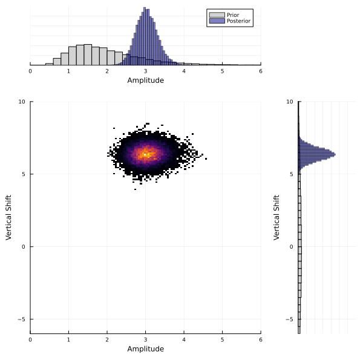

# Sinusoid Example

!!! info "How do I run this code?"
    The full code is found in the [`examples/`](https://github.com/CliMA/CalibrateEmulateSample.jl/tree/main/examples) directory of the github repository

## Background
This example demonstrates how to use `CalibrateEmulateSample.jl` for a simple model that generates noisy
observables of a signal. The sinusoid signal is defined by two parameters: its shift along the vertical axis
and its amplitude. We make noisy observations of the signal and we can calculate the mean of the signal,
which is informative about its shift along the axis, and the range of the signal, which is informative 
about the amplitude. Although our sinusoid function is simple and quick to evaluate, we shall pretend it is non-differentiable and expensive to evaluate, as a case study for carrying out uncertainty quantification on 
more complex systems. Additionally, we will work in a "perfect model" setting for this example, meaning we will
generate pseudo-observations for our model and pretend that these are noisy observations of our system.


### Model
We have a model of a sinusoidal signal that is a function of parameters $\theta=(A,v)$, where $A$ is the amplitude of the signal and $v$ is vertical shift of the signal:

```math
f(A, v) = A \sin(\phi + t) + v, \forall t \in [0,2\pi]
```
Here, $\phi$ is the random phase of each signal. 
The goal is to estimate not just the point estimates of the parameters $\theta=(A,v)$, but entire probability distributions of them, given some noisy observations. We will use the range and mean of a signal as our observable: 
```math
G(\theta) = \big[ \text{range}\big(f(\theta)\big), \text{mean}\big(f(\theta)\big) \big] 
```
This highlights the role of choosing a good observable, in particular our choice of $G$ is independent of the random phase shift $\phi$ and is in fact deterministic. This allows us to write out an expression for the noisy observation, $y_{obs}$:
```math
y_{obs} = G(\theta) + \gamma, \qquad \gamma \sim \mathcal{N}(0, \Gamma)
```
where $\Gamma$ is the observational covariance matrix. We will assume the noise to be independent for each observable, giving us a diagonal covariance matrix.


# Walkthrough of code

You can find the full scripts to reproduce this tutorial in `examples/Sinusoid/`. The code is split into four sections:

1. Model set up in `sinusoid_setup.jl`
2. Calibrate in `calibrate.jl`
3. Emulate in `emulate.jl`
4. Sample in `sample.jl`

You do not need to explicitly run `sinusoid_setup.jl` as it is called from `calibrate.jl`. However, this file contains the functions for the model and for generating pseudo-observations. 
You will need to run steps 2-4 in order as each one relies on output saved from the previous steps.


## Set up 

First, we load the packages we need for setting up the model:
```julia
using LinearAlgebra, Random
using Plots
using JLD2
using Statistics, Distributions

```

We define a model that generates a sinusoid given parameters $\theta=(A,v)$ 
(amplitude and vertical shift). We will estimate these parameters from data.
The model adds a random phase shift upon evaluation.

```julia
# Define x-axis
dt = 0.01
trange = 0:dt:(2 * pi + dt)

function model(amplitude, vert_shift)
    # Set phi, the random phase
    phi = 2 * pi * rand()
    return amplitude * sin.(trange .+ phi) .+ vert_shift
end

```

We will define a "true" amplitude and vertical shift to generate some pseudo-observations. 
Let $\theta=(3.0, 7.0)$.
```julia
amplitude_true = 3.0
vert_shift_true = 7.0
# Our input parameters are 2d and our outputs are 2d
theta_true = [amplitude_true, vert_shift_true]
dim_params = 2
# Generate the "true" signal for these parameters
signal_true = model(amplitude_true, vert_shift_true)
```
We will observe properties of the signal that inform us about the amplitude and vertical 
position. These properties will be the range (the difference between the maximum and the minimum),
which is informative about the amplitude of the sinusoid, and the mean, which is informative 
about the vertical shift. 
```julia
y1_true = maximum(signal_true) - minimum(signal_true)
y2_true = mean(signal_true)
```
However, our observations are typically not noise-free, so we add some white noise to our 
observables. We call this $y_{obs}$. The user can choose the observational covariance matrix, $\Gamma$. We will assume the noise is independent (a diagonal covariance matrix $\Gamma=0.2 * I$). 
```julia
dim_output = 2
Γ = 0.2 * I
white_noise = MvNormal(zeros(dim_output), Γ)
y_obs = [y1_true, y2_true] .+ rand(white_noise)
println("Observations:", y_obs)
```
This gives $y_{obs}=(6.15, 6.42)$.
We can plot the true signal in black, the true observables in red and the noisy observables in blue.


It will be helpful for us to define a function $G(\theta)$, which returns these observables 
(the range and the mean) of the sinusoid given a parameter vector. 

```julia
function G(theta)
    amplitude, vert_shift = theta
    sincurve = model(amplitude, vert_shift)
    return [maximum(sincurve) - minimum(sincurve), mean(sincurve)]
end
```

## Calibrate

We are interested in learning the posterior distribution of $\theta$ for the inverse problem
$y_{obs}=G(\theta)+\mathcal{N}(0,\Gamma)$. We first carry out calibration, which aims to solve the inverse problem
for point estimates of the optimal values for $\theta$. Specifically, we use an ensemble based calibration method, 
such as Ensemble Kalman Inversion, because it provides us with ensembles of $G(\theta)$ evaluations that 
are focused near to the optimal values for $\theta$. These ensembles provide us with a suitable dataset 
for training an emulator to be used in sampling the posterior distribution. 

We are using the [EnsembleKalmanProcesses.jl](https://clima.github.io/EnsembleKalmanProcesses.jl/dev/)
package for Ensemble Kalman Inversion (EKI). We start with user-defined prior distributions and sample
an ensemble of parameters $\theta$, which we use to evaluate $G(\theta)$. Then, we iteratively update the
ensemble until our parameters $\theta$ are near to the optimal.

First, we will load the packages we need from CES:

```julia
# CES
using CalibrateEmulateSample
const EKP = CalibrateEmulateSample.EnsembleKalmanProcesses
const PD = EKP.ParameterDistributions
```
 
We define prior distributions on the two parameters. For the amplitude,
we define a prior with mean 2 and standard deviation 1. It is
additionally constrained to be nonnegative. For the vertical shift we define
a Gaussian prior with mean 0 and standard deviation 5.
```julia
prior_u1 = PD.constrained_gaussian("amplitude", 2, 1, 0, Inf)
prior_u2 = PD.constrained_gaussian("vert_shift", 0, 5, -Inf, Inf)
prior = PD.combine_distributions([prior_u1, prior_u2])
# Plot priors
p = plot(prior, fill = :lightgray)
```


We now generate the initial ensemble and set up the EKI.
```julia
N_ensemble = 10
N_iterations = 5

initial_ensemble = EKP.construct_initial_ensemble(prior, N_ensemble)

ensemble_kalman_process = EKP.EnsembleKalmanProcess(initial_ensemble, y_obs, Γ, EKP.Inversion())
```

We are now ready to carry out the inversion. At each iteration, we get the
ensemble from the last iteration, apply $G(\theta)$ to each ensemble member,
and apply the Kalman update to the ensemble.
```julia
for i in 1:N_iterations
    params_i = EKP.get_ϕ_final(prior, ensemble_kalman_process)

    G_ens = hcat([G(params_i[:, i]) for i in 1:N_ensemble]...)

    EKP.update_ensemble!(ensemble_kalman_process, G_ens)
end
```

Finally, we get the ensemble after the last iteration. This provides our estimate of the parameters.
```julia
final_ensemble = EKP.get_ϕ_final(prior, ensemble_kalman_process)

# Check that the ensemble mean is close to the theta_true
println("Ensemble mean: ", mean(final_ensemble, dims=2))   # [3.05, 6.37]
println("True parameters: ", theta_true)   # [3.0, 7.0]
```

| Parameter         | Truth    | EKI mean |
| :---------------- | :------: | :----: |
| Amplitude         |   3.0    | 3.05  |
| Vertical shift    |   7.0    | 6.37  |

The EKI ensemble mean at the final iteration is close to the true parameters, which is good.
We can also see how the ensembles evolve at each iteration in the plot below.


The ensembles are initially spread out but move closer to the true parameter values
with each iteration, indicating the EKI algorithm is converging towards the minimum.
Taking the mean of the ensemble gives a point estimate of the optimal parameters.
However, EKI does not give us an estimate of the uncertainty, as the ensemble collapses.
To carry out uncertainty quantification, we can sample from the posterior distribution,
which requires a "cheap" method to evaluate our model, i.e., an emulator. 
In the next step of CES, we will build an emulator using the dataset generated in EKI.

## Emulate

In the previous calibrate step, we learned point estimates for the optimal parameters $\theta$, but 
for uncertainty quantification, we want to learn posterior distributions on our parameters.
We can sample from posterior distributions with Markov chain Monte Carlo (MCMC) methods, but these 
typically require many model evaluations. In many scientific problems, model evaluations are highly 
costly, making this infeasible. To get around this, we build an emulator of our model, 
which allows us to approximate the expensive model almost instantaneously. An emulator can also be 
helpful for noisy problems as they provide a smoother approximation, leading to better MCMC 
convergence properties. 
In this section, we show how the codebase can be used to build emulators of our sinusoid model.

We ran Ensemble Kalman Inversion with an ensemble size of 10 for 5 
iterations. This generated a total of 50 input output pairs from our model.
We will use these samples to train an emulator. The EKI samples make a suitable 
dataset for training an emulator because in the first iteration, the ensemble parameters 
are spread out according to the prior, meaning they cover the full support of the
parameter space. This is important for building an emulator that can be evaluated anywhere 
in this space. In later iterations, the ensemble parameters are focused around the truth. 
This means the emulator that will be more accurate around this region.

First, we load additional packages we need for this section:
```julia
using CalibrateEmulateSample.Emulators
const CES = CalibrateEmulateSample
```

We will build two types of emulator here for comparison: Gaussian processes and Random 
Features. First, set up the data in the correct format. CalibrateEmulateSample.jl uses
a paired data container that matches the inputs (in the unconstrained space) to the outputs:

```julia
input_output_pairs = CES.Utilities.get_training_points(ensemble_kalman_process, N_iterations)
unconstrained_inputs = CES.Utilities.get_inputs(input_output_pairs)
inputs = Emulators.transform_unconstrained_to_constrained(prior, unconstrained_inputs)
outputs = CES.Utilities.get_outputs(input_output_pairs)
```

### Gaussian process
We will set up a basic Gaussian process (GP) emulator using the [`ScikitLearn.jl`](https://scikitlearnjl.readthedocs.io/en/latest/models/#scikitlearn-models) package or [`GaussianProcesses.jl`](https://stor-i.github.io/GaussianProcesses.jl/latest/). 
See the [Gaussian process page](https://clima.github.io/CalibrateEmulateSample.jl/dev/GaussianProcessEmulator/) for more information and options, including choice of package and kernels.
```julia
gppackage = Emulators.GPJL()
gauss_proc = Emulators.GaussianProcess(gppackage, noise_learn = false)

# Build emulator with data
emulator_gp = Emulator(gauss_proc, input_output_pairs, normalize_inputs = true,  obs_noise_cov = Γ)
optimize_hyperparameters!(emulator_gp)
```
For this simple example, we already know the observational noise `Γ=0.2*I`, so we set `noise_learn = false`. 
However, for more complicated problems we may want to learn the noise as an additional hyperparameter.

We will check performance of the GP by testing on unseen data in a moment, but first, we will build a random features emulator for comparison.

### Random Features
An alternative emulator can be created with random features (RF). Random features can approximate a Gaussian process
with improved scaling properties, making them more suitable for higher dimensional problems. We use a Vector Random
Features emulator here, chosen because we find it is a reasonable approximation to the Gaussian process emulator above.
For new problems, you may need to play around with these parameter choices.
More information can be found [here](https://clima.github.io/CalibrateEmulateSample.jl/dev/random_feature_emulator/).

```julia
# We have two input dimensions and two output dimensions.
input_dim = 2
output_dim = 2
# Select number of features
n_features = 60
nugget = 1e-9
kernel_structure = NonseparableKernel(LowRankFactor(2, nugget))
optimizer_options = Dict(
    "n_ensemble" => 50,
    "cov_sample_multiplier" => 10,
    "scheduler" => EKP.DataMisfitController(on_terminate = "continue"),
    "n_iteration" => 50,
    "verbose" => true,
)
random_features = VectorRandomFeatureInterface(
    n_features,
    input_dim,
    output_dim,
    kernel_structure = kernel_structure,
    optimizer_options = optimizer_options,
)
emulator_random_features =
    Emulator(random_features, input_output_pairs, normalize_inputs = true, obs_noise_cov = Γ, decorrelate = false)
optimize_hyperparameters!(emulator_random_features)
```
### Emulator Validation

Now we will validate both GP and RF emulators and compare them against the ground truth, $G(\theta)$.
Note this is only possible in our example because our true model, $G(\theta)$, is cheap to evaluate. In more complex systems, we would have limited data to validate emulator performance with. 

Here, we will compare emulator performance across a wide range of parameters, but we will pay close attention to 
performance near the final ensemble mean $\theta=(3, 6)$. This is because we need high accuracy in this region
in the next step, when we sample the posterior distribution.

First, we check the ground truth model $G(\theta)$ over our parameter space. We can plot how the two outputs (range, mean), vary with the two input parameters (amplitude, vertical shift).


The first panel shows how the range varies with respect to the two parameters in the true forward map. The contours show the range is mostly dependent on the amplitude, with little variation with
respect to the vertical shift. The second panel shows how the mean varies with the respect to the two
parameters and is mostly dependent on the vertical shift. This result makes sense for our model setup.

Below, we recreate the same contour plot with the emulators. We will also overlay the training data points 
from the EKI, where the colors show the output from $G(\theta)$ evaluated at the training points. 
The emulator contours should agree with the training data.

First, for the Gaussian process emulator:



This looks similar to the output from $G(\theta)$. Next, let's check the random features emulator:


Both the GP and RF emulator give similar results to the ground truth $G(\theta)$, indicating they are correctly
learning the relationships between the parameters and the outputs. We also see the contours agree with the 
colors of the training data points. 

We should also validate how accurate the emulators are by looking at the absolute difference between emulator
predictions and the ground truth. 

The Gaussian process absolute errors are plotted here:


and the random features absolute errors are here:


Both these error maps look similar. Importantly, we want the emulator to show the low errors in the region around the true parameter values near $\theta=(3, 6)$ (i.e, near where the EKI points converge, shown by the scatter points in
the previous plot). This the region that we will be sampling in the next step. 
We see low errors near here for both outputs and for both emulators. Now we have validated these emulators, 
we will proceed the last step of CES: Sampling of the posterior distribution. 

## Sample

Now that we have a cheap emulator for our model, we can carry out uncertainty quantification
to learn the posterier distribution of the parameters, $\theta$. We use Markov chain Monte Carlo
(MCMC) to sample the posterior distribtion. In MCMC, we start with a sample from a prior distribution
and propose a new sample from a proposal distribution, which is accepted with a probability relating the
the ratio of the posterior distribution to the proposal distributions. If accepted, this proposed sample is 
added to the chain, or otherwise, the original sample is added to the chain. This is repeated over many
iterations and eventually creates a sequence of samples from the posterior distribution.
The CES code uses [AbstractMCMC.jl](https://turing.ml/dev/docs/for-developers/interface), full details can be found [here](https://clima.github.io/CalibrateEmulateSample.jl/dev/API/AbstractMCMC/).
For this example, we will use a random walk Metropolis-Hastings sampler (`RWMHSampling`), which assumes that 
the proposal distribution is a random walk, with a step-size $\delta$. Usually, we have little knowledge of 
what this step size should be, but we can optimize this as shown below.

First, we will load the additional packages we need:
```julia
using CalibrateEmulateSample.MarkovChainMonteCarlo
```

We will provide the API with the observations, priors and our cheap emulator from the previous section. In this 
example we use the GP emulator. First, we need to find a suitable starting point, ideally one that is near the posterior distribution. We will use the final ensemble mean from EKI as this will increase the chance of acceptance near the start of the chain, and reduce burn-in time.
```julia
init_sample = EKP.get_u_mean_final(ensemble_kalman_process)
println("initial parameters: ", init_sample)    # (1.11, 6.37)
```

Now, we can set up and carry out the MCMC starting from this point. 
```julia
mcmc = MCMCWrapper(RWMHSampling(), y_obs, prior, emulator_gp; init_params = init_sample)
# First let's run a short chain to determine a good step size
new_step = optimize_stepsize(mcmc; init_stepsize = 0.1, N = 2000, discard_initial = 0)

# Now begin the actual MCMC
println("Begin MCMC - with step size ", new_step)
chain = MarkovChainMonteCarlo.sample(mcmc, 100_000; stepsize = new_step, discard_initial = 2_000)

# We can print summary statistics of the MCMC chain
display(chain)
```

| parameters         | mean    | std |
| :---------------- | :------: | :----: |
| amplitude         |   1.1068 | 0.0943  |
| vert_shift        |   6.3897 | 0.4601  |

Note that these values are provided in the unconstrained space. The vertical shift
seems reasonable, but the amplitude is not. This is because the amplitude is constrained to be
positive, but the MCMC is run in the unconstrained space.  We can transform to the real 
constrained space and re-calculate these values.

```julia
# Extract posterior samples
posterior = MarkovChainMonteCarlo.get_posterior(mcmc, chain)
# Back to constrained coordinates
constrained_posterior = Emulators.transform_unconstrained_to_constrained(
    prior, MarkovChainMonteCarlo.get_distribution(posterior)
)
println("Amplitude mean: ", mean(constrained_posterior["amplitude"]), ", std: ", std(constrained_posterior["amplitude"]))
println("Vertical shift mean: ", mean(constrained_posterior["vert_shift"]), ", std: ", std(constrained_posterior["vert_shift"]))
```
This gives:


| parameters        | mean     | std     |
| :---------------- | :------: | :----:  |
| amplitude         |   3.0382 | 0.2880  |
| vert_shift        |   6.3774 | 0.4586  |

This is in agreement with the true $\theta=(3.0, 7.0)$ and with the observational covariance matrix we provided $\Gamma=0.2 * I$ (i.e., a standard deviation of approx. $0.45$). `CalibrateEmulateSample.jl` has built-in plotting
recipes to help us visualize the prior and posterior distributions.  Note that these are the
marginal distributions.

```julia
# We can quickly plot priors and posterior using built-in capabilities
p = plot(prior, fill = :lightgray)
plot!(posterior, fill = :darkblue, alpha = 0.5)

```


The MCMC has learned the posterior distribution which is much narrower than the prior. 
For multidimensional problems, the posterior is typically multidimensional, and marginal 
distribution plots do not show how parameters co-vary. We plot a 2D histogram of $\theta_1$ vs.
$\theta_2$ below, with the marginal distributions on each axis. 




### Sample with Random Features

We can repeat the sampling method using the random features emulator instead of the Gaussian
process and we find similar results: 

| parameters        | mean     | std    |
| :---------------- | :------: | :----: |
| amplitude         |   3.3210 | 0.7216 |
| vert_shift        |   6.3986 | 0.5098 |


It is reassuring to see that our uncertainty quantification methods are robust to the different emulator
choices here. This is because our particular GP and RF emulators showed similar accuracy during validation. 
However, this result is highly sensitive to the choices of GP kernel and RF kernel structure. If you find very 
different posterior distributions for different emulators, it is likely that the kernel choices need be refined.
The kernel choices must be flexible enough to accurately capture the relationships between the inputs and outputs. 
We recommend trying a variety of different emulator configurations and carefully considering emulator validation 
on samples that the emulator has not been trained on. 
