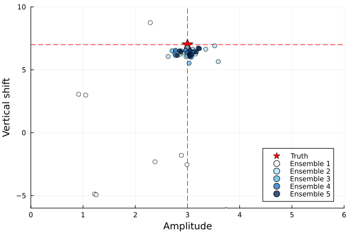

# CalibrateEmulateSample.jl

`CalibrateEmulateSample.jl` solves parameter estimation problems using accelerated (and approximate) Bayesian inversion.

The framework can be applied currently to learn:
- the joint distribution for a moderate numbers of parameters (<40),
- it is not inherently restricted to unimodal distributions.

It can be used with computer models that:
- can be noisy or chaotic,
- are non-differentiable,
- can only be treated as black-box (interfaced only with parameter files).

The computer model is supplied by the user, as a parameter-to-data map ``\mathcal{G}(\theta): \mathbb{R}^p \rightarrow \mathbb{R}^d``. For example, ``\mathcal{G}`` could be a map from any given parameter configuration ``\theta`` to a collection of statistics of a dynamical system trajectory. ``\mathcal{G}`` is referred to as the forward model in the Bayesian inverse problem setting.

The data produced by the forward model are compared to observations $y$, which are assumed to be corrupted by additive noise ``\eta``, such that
```math
y = \mathcal{G}(\theta) + \eta,
```
where the noise ``\eta`` is drawn from a $d$-dimensional Gaussian with distribution ``\mathcal{N}(0, \Gamma_y)``.

### The inverse problem

Given an observation ``y``, the computer model ``\mathcal{G}``, the observational noise ``\Gamma_y``, and some broad prior information on ``\theta``, we return the joint distribution of a data-informed distribution for "``\theta`` given ``y``".
 
As the name suggests, `CalibrateEmulateSample.jl` breaks this problem into a sequence of three steps: calibration, emulation, and sampling. A comprehensive treatment of the calibrate-emulate-sample approach to Bayesian inverse problems can be found in [Cleary et al. (2020)](https://arxiv.org/pdf/2001.03689.pdf).

### The three steps of the algorithm: see our walkthrough of the [Sinusoid Example](@ref)

**Given some noisy observations...**
```@raw html

```

1. The **calibrate** step of the algorithm consists of an application of [Ensemble Kalman Processes](https://github.com/CliMA/EnsembleKalmanProcesses.jl), which generates input-output pairs ``\{\theta, \mathcal{G}(\theta)\}`` in high density around an optimal parameter ``\theta^*``. This ``\theta^*`` will be near a mode of the posterior distribution (Note: This the only time we interface with the forward model ``\mathcal{G}``).

**calibrate with EKP to generate data pairs...**
```@raw html

```

2. The **emulate** step takes these pairs ``\{\theta, \mathcal{G}(\theta)\}`` and trains a statistical surrogate model (e.g., a Gaussian process), emulating the forward map ``\mathcal{G}``.

**emulate the map statistically from EKP pairs...** 
```@raw html

```
3. The **sample** step uses this surrogate in place of ``\mathcal{G}`` in a sampling method (Markov chain Monte Carlo) to sample the posterior distribution of ``\theta``.

**sample the emulated map with MCMC...**
```@raw html

```

## Code Components

`CalibrateEmulateSample.jl` contains the following modules:

Module                                 | Purpose
---------------------------------------|--------------------------------------------------------
CalibrateEmulateSample.jl              | A wrapper for the pipeline
Emulator.jl                            | Modular template for the emulators
GaussianProcess.jl                     | A Gaussian process emulator
Scalar/VectorRandomFeatureInterface.jl | A Scalar/Vector-output Random Feature emulator 
MarkovChainMonteCarlo.jl               | Modular template for Markov Chain Monte Carlo samplers
Utilities.jl                           | Helper functions


## Authors

`CalibrateEmulateSample.jl` is being developed by the [Climate Modeling
Alliance](https://clima.caltech.edu).