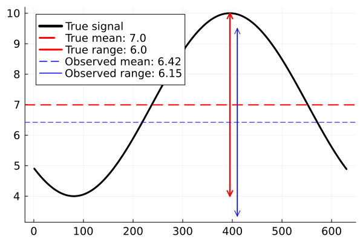
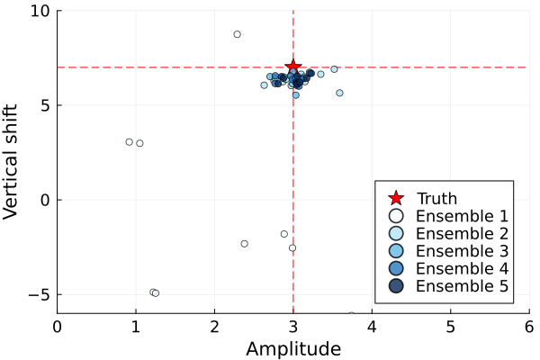
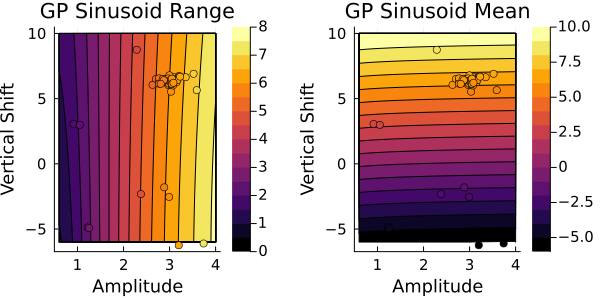
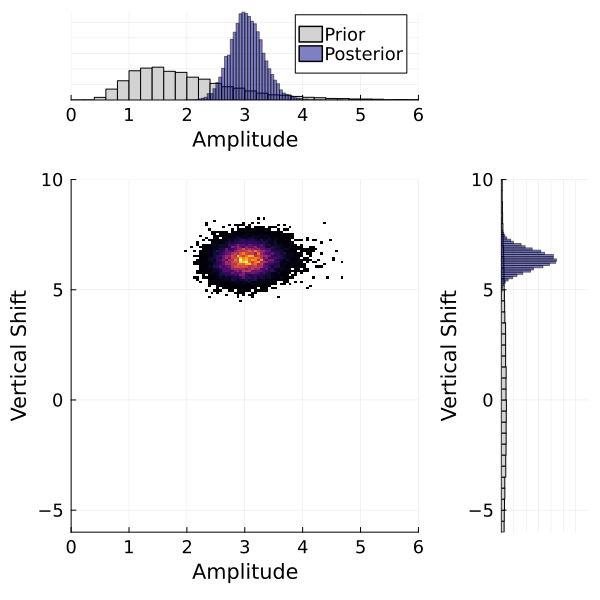

# Summary

A Julia language [@julia] package providing practical and modular implementation of ``Calibrate, Emulate, Sample" [@Cleary:2021], hereafter CES, an accelerated workflow for obtaining model parametric uncertainty is presented. This is also known as Bayesian inversion or uncertainty quantification. To apply CES one requires a computer model (written in any programming language) dependent on free parameters, a prior distribution encoding some prior knowledge about the distribution over the free parameters, and some data with which to constrain this prior distribution. The pipeline has three stages, most easily explained in reverse:

1. The goal of the workflow is to draw samples (Sample) from the Bayesian posterior distribution, that is, the prior distribution conditioned on the observed data,
2. To accelerate and regularize sampling we train statistical emulators to represent the user-provided parameter-to-data map (Emulate),
3. The training points for these emulators are generated by the computer model, and selected adaptively around regions of high posterior mass (Calibrate).

We describe CES as an accelerated workflow, as it is often able to use dramatically fewer evaluations of the computer model when compared with applying sampling algorithms, such as Markov chain Monte Carlo (MCMC), directly.

* Calibration tools: We recommend choosing adaptive training points with Ensemble Kalman methods such as EKI [@Iglesias:2013] and its variants [@Huang:2022]; and CES provides explicit utilities from the codebase EnsembleKalmanProcesses.jl [@Dunbar:2022a].
* Emulation tools: CES integrates any statistical emulator, currently implemented are Gaussian Processes (GP) [@Rasmussen:2006], explicitly provided through packages SciKitLearn.jl [@scikit-learn] and GaussianProcesses.jl [@Fairbrother:2022], and Random Features [@Rahimi:2007;@Rahimi:2008;@Liu:2022], explicitly provided through [RandomFeatures.jl](https://doi.org/10.5281/zenodo.7141158) that can provide additional flexibility and scalability, particularly in higher dimensions.
* Sampling tools: The regularized and accelerated sampling problem is solved with MCMC, and CES provides the variants of Random Walk Metropolis [@Metropolis:1953;@Sherlock:2010], and preconditioned Crank-Nicholson [@Cotter:2013], using APIs from [Turing.jl](https://turinglang.org/). Some regular emulator mean functions are differentiable, and including accelerations of derivative-based MCMC into CES, [e.g., NUTS, @hoffman:2014; Barker, @livingstone:2022]; is an active direction of work. 

To highlight code accessibility, we also provide a suite of detailed scientifically-inspired examples, with documentation that walks users through some use cases. Such use cases not only demonstrate the capability of the CES pipeline, but also teach users about typical interface and workflow experience.


# Statement of need

Computationally expensive computer codes for predictive modelling are ubiquitous across science and engineering disciplines. Free parameter values that exist within these modelling frameworks are typically constrained by observations to produce accurate and robust predictions about the system they are approximating numerically. In a Bayesian setting, this is viewed as evolving an initial parameter distribution (based on prior information) with the input of observed data, to a more informative data-consistent distribution (posterior). Unfortunately, this task is intensely computationally expensive, commonly requiring over $10^5$ evaluations of the expensive computer code (e.g., Random Walk Metropolis), with accelerations relying on intrusive model information, such as a derivative of the parameter-to-data map. CES is able to approximate and accelerate this process in a non-intrusive fashion and requiring only on the order of $10^2$ evaluations of the original computer model. This opens the doors for quantifying parametric uncertainty for a class of numerically intensive computer codes that has previously been unavailable.


# State of the field

In Julia there are a few tools for performing non-accelerated uncertainty quantification, from classical sensitivity analysis approaches, for example, [UncertaintyQuantification.jl](https://zenodo.org/records/10149017), GlobalSensitivity.jl [@Dixit:2022], and MCMC, for example, [Mamba.jl](https://github.com/brian-j-smith/Mamba.jl) or [Turing.jl](https://turinglang.org/). For computational efficiency, ensemble methods also provide approximate sampling, [e.g., the Ensemble Kalman Sampler @Garbuno-Inigo:2020b;@Dunbar:2022a], though these only provide Gaussian approximations of the posterior.

Accelerated uncertainty quantification tools also exist for the related approach of Approximate Bayesian Computation (ABC), for example, GpABC [@Tankhilevich:2020] or [ApproxBayes.jl](https://github.com/marcjwilliams1/ApproxBayes.jl?tab=readme-ov-file); these tools both approximately sample from the posterior distribution. In ABC, this approximation comes from bypassing the likelihood that is usually required in sampling methods, such as MCMC. Instead, the goal of ABC is to replace the likelihood with a scalar-valued sampling objective that compares model and data. In CES, the approximation comes from learning the parameter-to-data map, then following this it calculates an explicit likelihood and uses exact sampling via MCMC. Some ABC algorithms also make use of statistical emulators to further accelerate sampling (GpABC). Although flexible, ABC encounters challenges due to the subjectivity of summary statistics and distance metrics, that may lead to approximation errors particularly in high-dimensional settings [@Nott:2018]. CES is more restrictive due to use of an explicit Gaussian likelihood, but also leverages this structure to deal with high dimensional data.

Several other tools are available in other languages for a purpose of accelerated learning of the posterior distribution or posterior sampling. Two such examples, written in Python, approximate the log-posterior distribution directly with a Gaussian process: [PyVBMC](https://github.com/acerbilab/pyvbmc) [@Huggins:2023] additionaly uses variational approximations to calculate the normalization constant, and [GPry](https://github.com/jonaselgammal/GPry) [@Gammal:2023], which iteratively trains the GP with an active training point selection algorithm. Such algorithms are distinct from CES, which approximates the parameter-to-data map with the Gaussian process, and advocates ensemble Kalman methods to select training points. 

# A simple example from the code documentation

We sketch an end-to-end example of the pipeline, with fully-detailed walkthrough given in the online documentation.

We have a model of a sinusoidal signal that is a function of parameters $\theta=(A,v)$, where $A$ is the amplitude of the signal and $v$ is vertical shift of the signal $$f(A, v) = A \sin(\phi + t) + v, \forall t \in [0,2\pi].$$ Here, $\phi$ is the random phase of each signal. 
The goal is to estimate not just point estimates of the parameters $\theta=(A,v)$, but entire probability distributions of them, given some noisy observations. We will use the range and mean of a signal as our observable: $$ G(\theta) = \big[ \text{range}\big(f(\theta)\big), \text{mean}\big(f(\theta)\big) \big] $$ Then, our noisy observations, $y_{obs}$, can be written as: $$ y_{obs} = G(\theta^\dagger) + \mathcal{N}(0, \Gamma)$$ where $\Gamma$ is the observational covariance matrix. We will assume the noise to be independent for each observable, giving us a diagonal covariance matrix. 

{width=50%}

For this experiment $\theta^\dagger = (A^\dagger,v^\dagger) = (3.0, 7.0)$, and the noisy observations are displayed in blue in \autoref{fig:signal}.

We define prior distributions on the two parameters. For the amplitude,
we define a prior with mean 2 and standard deviation 1. It is
additionally constrained to be nonnegative. For the vertical shift we define
a prior with mean 0 and standard deviation 5.
```julia
const PD = CalibrateEmulateSample.ParameterDistributions
prior_u1 = PD.constrained_gaussian("amplitude", 2, 1, 0, Inf)
prior_u2 = PD.constrained_gaussian("vert_shift", 0, 5, -Inf, Inf)
prior = PD.combine_distributions([prior_u1, prior_u2])
```

{width=70%}

The prior is displayed in \autoref{fig:prior}.

We now adaptively find input-output pairs from our map $G$ in a region of interest using an inversion method (an ensemble Kalman process). This is the Calibrate stage, and iteratively generates parameter combinations, that refine around a region of high posterior mass.
```julia
const EKP = CalibrateEmulateSample.EnsembleKalmanProcesses
N_ensemble = 10
N_iterations = 5
initial_ensemble = EKP.construct_initial_ensemble(prior, N_ensemble)
ensemble_kalman_process = EKP.EnsembleKalmanProcess(
    initial_ensemble, y_obs, Γ, EKP.Inversion(); 
)
for i in 1:N_iterations
    params_i = EKP.get_phi_final(prior, ensemble_kalman_process)
    G_ens = hcat([G(params_i[:, i]) for i in 1:N_ensemble]...)
    EKP.update_ensemble!(ensemble_kalman_process, G_ens)
end
```

{width=60%}

The adaptively refined training points from EKP are displayed in \autoref{fig:eki}. We now build an basic Gaussian process emulator from the GaussianProcesses.jl package to emulate the map $G$ using these points.

```julia
const UT = CalibrateEmulateSample.Utilities
const EM = CalibrateEmulateSample.Emulators

input_output_pairs = UT.get_training_points(
    ensemble_kalman_process, N_iterations,
)
gppackage = EM.GPJL() 
gauss_proc = EM.GaussianProcess(gppackage, noise_learn = false)
emulator = EM.Emulator(
    gauss_proc, input_output_pairs, normalize_inputs = true,  obs_noise_cov = Γ,
) 
EM.optimize_hyperparameters!(emulator) # train the emulator
```

{width=80%}

We evaluate the mean of this emulator on a grid, and also show the value of the true $G$ at training point locations in \autoref{fig:GP_emulator}.

We can then sample with this emulator using an MCMC scheme. We first choose a good step size (an algorithm parameter) by running some short sampling runs (of length 2,000 steps). Then we run the 100,000 step sampling run to generate samples of the joint posterior distribution.
```julia
const MC = CalibrateEmulateSample.MarkovChainMonteCarlo
mcmc = MC.MCMCWrapper(
    MC.RWMHSampling(), y_obs, prior, emulator,
)
# choose a step size
new_step = MC.optimize_stepsize(
    mcmc; init_stepsize = 0.1, N = 2000,
)
# Now begin the actual MCMC
chain = MC.sample(
    mcmc, 100_000; stepsize = new_step, discard_initial = 2_000,
)
```

{width=60%}

A histogram of the samples from the CES algorithm is displayed in \autoref{fig:GP_2d_posterior}. We see that the posterior distribution contains the true value $(3.0, 7.0)$ with high probability.

# Research projects using the package
Some research projects that use this codebase, or modifications of it, are

* [@Dunbar:2021]
* [@Bieli:2022]
* [@Hillier:2022]
* [@Howland:2022]
* [@Dunbar:2022b]
* [@Mansfield:2022]
* [@King:2023]

# Acknowledgements

We acknowledge contributions from several others who played a role in the evolution of this package. These include Adeline Hillier, Ignacio Lopez Gomez and Thomas Jackson. The development of this package was supported by the generosity of Eric and Wendy Schmidt by recommendation of the Schmidt Futures program, National Science Foundation Grant AGS-1835860, the Defense Advanced Research Projects Agency (Agreement No. HR00112290030), the Heising-Simons Foundation, Audi Environmental Foundation, and the Cisco Foundation.


# References